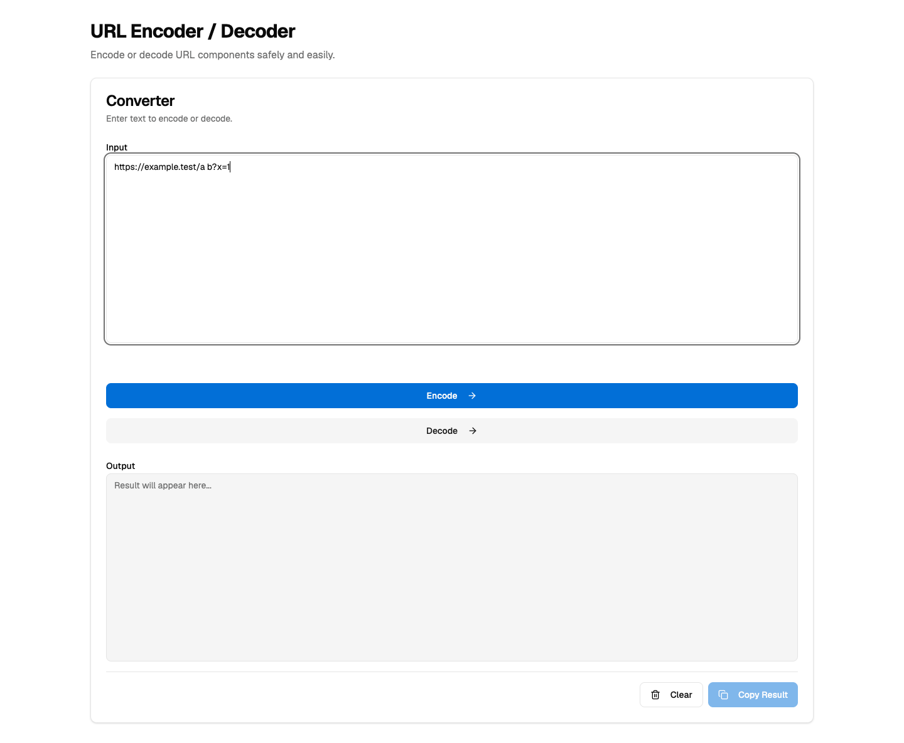
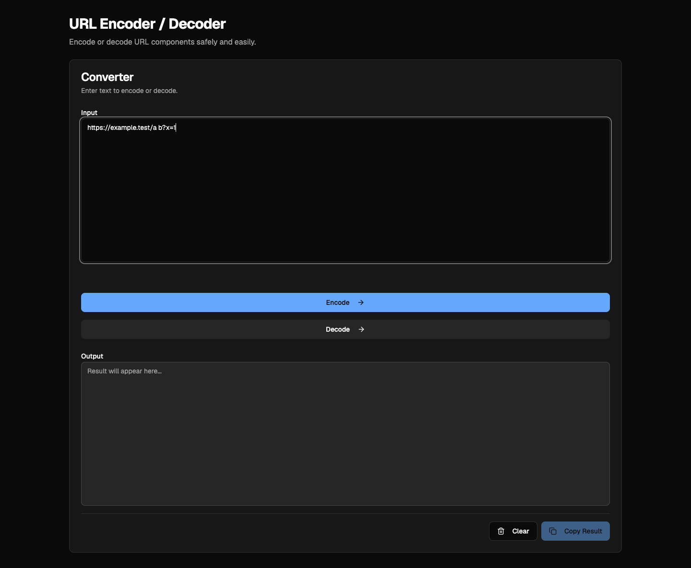

# SP1 目視検証記録 — url-encoder (Tailwind v4 + oklch)

**日付**: 2026-07-30

**対象**: `apps/url-encoder`（HEAD: `efb43e528142b7dbf772212b50b19e084e112c1f`）

**検証者**: Codex（agent-browser）
**実行環境**: macOS Darwin 25.3.0 / Node.js v24.18.1 / pnpm 10.32.1 / agent-browser 0.20.11 / HeadlessChrome 146.0.0.0 / viewport 1440×1000（DPR 1）

## 実行条件・起動停止証跡

- 指定の5173番ポートは外部 `com.docker`（PID 45650）が占有しており、`curl http://localhost:5173/` は `000` だったため停止対象にしなかった。
- 起動コマンド: `pnpm --filter url-encoder dev -- --host 127.0.0.1`
- Viteは5173使用中を検出して自動退避し、実際の検証URLは `http://127.0.0.1:5174/` となった。
- 起動確認: `curl -s -o /tmp/sp1-url-encoder-5174-index.html -w '%{http_code}' http://127.0.0.1:5174/` → `200`。HTMLは928 bytesで、`<title>URL Encoder - Elchika Tools</title>` と `#root`、`/src/main.tsx` を確認した。
- 停止確認: 自分が起動したViteへSIGINTを送信後、`curl -s -o /dev/null -w '%{http_code}' http://127.0.0.1:5174/` → `000`、5174のLISTENプロセスなし。

## 成功基準

- lightでは、見出し・説明文・border・角丸・primary button・フォーカス状態を実画面とcomputed styleで確認する。
- darkでは、暗背景上の文字・明るいprimary buttonと暗文字・border・透明度合成の崩壊なしを実画面とcomputed styleで確認する。
- 指定PNGを各テーマで保存し、PNG形式・サイズ・非空であることを確認する。
- Tabキーでフォーカスが移動し、フォーカスリングが可視であることを実画面とcomputed `box-shadow` で判定する。

## G6: light テーマ



| # | 観点 | 結果 | 実測値・観測内容 |
|---:|---|---|---|
| 1 | ヘッダ h1・説明文が読める | ✅ | 実画面で黒いh1と灰色説明文を白背景上で確認。h1 `oklch(0.145 0 0)`、説明文 `oklch(0.54 0 0)`。 |
| 2 | ボタンが青地に白文字 | ✅ | 入力値 `https://example.test/a b?x=1` を投入して有効化。Encodeは `disabled=false`、`opacity=1`、背景 `oklch(0.55 0.18 255)`、文字 `oklch(0.985 0 0)`。 |
| 3 | 入力欄・テキストエリアの枠線が見える | ✅ | 実画面でInput/Output双方の枠線を確認。双方 `1px solid oklch(0.922 0 0)`。 |
| 4 | 角丸が付いている | ✅ | rootの `--radius=0.625rem`。Input/Outputの実computed `border-radius=8px`。 |
| 5 | 欧文 Geist・和文フォールバックが自然 | ✅（一時DOM probe） | computed font stackは `"Geist Variable", "Hiragino Sans", "Noto Sans JP", "Yu Gothic UI", sans-serif`。製品画面には日本語本文がないため、一時可視probe「日本語フォールバック表示確認」を追加し、崩れのない実描画（`isVisible=true`、`1152×30px`）を目視した。Geistの`unicode-range`はCJKを含まず、日本語は後続fallbackで描画されることも確認した。reload後はprobe要素・文字列とも不存在で、元の製品DOMへ戻った。 |
| 6 | Tabキーでフォーカスが移動し、フォーカスリングが可視 | ✅（standardsとの差異を受容） | `Tab`でInputへ移動し、画像でもフォーカス状態を保存。実computed `box-shadow` は白offset `2px` とring `4px` の外縁で、フォーカスは明瞭に可視だった。standards §5 がSHOULDとする`ring-[3px]`とは異なるが、`focus-visible:ring-2 focus-visible:ring-offset-2`はv3時代のshadcnデフォルトであり、344アプリの`button.tsx`が同じ実装を持つ。SP1は実装方式の置換でUI再設計を含まないため変更せず、standards §5準拠は別途起票済み。 |

### standards §5 との差異の受容

外縁4pxは3pxよりフォーカスを目立たせる方向の差異であり、視認性の実害は観測されなかった。url-encoderだけを変更すると他345アプリとの不整合を作るため、SP1では実装を維持する。これは成功基準を黙って緩めたものではなく、実測差異を記録したうえでスコープ外として受容した判断である。

## G7: dark テーマ



`document.documentElement.classList.add('dark')` を実行して確認した。

| # | 観点 | 結果 | 実測値・観測内容 |
|---:|---|---|---|
| 7 | 本文テキストが読める | ✅ | 実画面で暗背景・明るい見出し/本文を確認。body背景 `oklch(0.145 0 0)`、body/h1文字 `oklch(0.985 0 0)`、説明文 `oklch(0.708 0 0)`。 |
| 8 | ボタンが明るい青地に暗い文字 | ✅ | 有効なEncodeの背景 `oklch(0.72 0.14 255)`、文字 `oklch(0.145 0 0)`、`opacity=1`。実画面でも明るい青と暗文字を確認。 |
| 9 | 透明度合成によるコントラスト崩壊がない | ✅ | 実画面でCard・Input・Output・buttonの文字と面が識別可能。DOM全要素を走査し、半透明`background-color`を持つ要素は0件。半透明はborder/input tokenのみで、Card背景は不透明 `oklch(0.205 0 0)`。 |
| 10 | 枠線が背景に溶けていない | ✅ | 実画面でCard/Input/Outputの枠線を確認。Card `1px solid oklch(1 0 0 / 0.1)`、Input/Output `1px solid oklch(1 0 0 / 0.15)`。 |

## スクリーンショットの実在確認

| ファイル | 形式・寸法 | サイズ | 判定 |
|---|---|---:|---|
| `2026-07-29-sp1-url-encoder-light.png` | PNG, 1440×1185, RGB | 40,871 bytes | ✅ |
| `2026-07-29-sp1-url-encoder-dark.png` | PNG, 1440×1185, RGB | 40,275 bytes | ✅ |

確認コマンド:

```sh
file .docs/verification/2026-07-29-sp1-url-encoder-light.png
wc -c .docs/verification/2026-07-29-sp1-url-encoder-light.png
file .docs/verification/2026-07-29-sp1-url-encoder-dark.png
wc -c .docs/verification/2026-07-29-sp1-url-encoder-dark.png
```

## 再現手順

```sh
pnpm --filter url-encoder dev -- --host 127.0.0.1
curl -s -o /tmp/sp1-url-encoder-5174-index.html -w '%{http_code}' http://127.0.0.1:5174/

agent-browser --session sp1-design-tokens-verify set viewport 1440 1000
agent-browser --session sp1-design-tokens-verify open http://127.0.0.1:5174/
agent-browser --session sp1-design-tokens-verify press Tab
agent-browser --session sp1-design-tokens-verify type '#input' 'https://example.test/a b?x=1'
agent-browser --session sp1-design-tokens-verify screenshot --full body .docs/verification/2026-07-29-sp1-url-encoder-light.png
agent-browser --session sp1-design-tokens-verify eval "document.documentElement.classList.add('dark')"
agent-browser --session sp1-design-tokens-verify screenshot --full body .docs/verification/2026-07-29-sp1-url-encoder-dark.png
```

停止後の確認:

```sh
curl -s -o /dev/null -w '%{http_code}' http://127.0.0.1:5174/
```

## 移行前との差異

移行前のスクリーンショットは提供されていないため、直接比較は未実施。見た目の差異は推測しない。

## SP2 へ引き継ぐ観点

- `focus-visible:ring-2` と `ring-offset-2` の合成は外縁4pxとなり、standards §5がSHOULDとする3pxとは異なる。SP1では可視性を確認して差異を受容し、共通是正は別途起票した。
- light/darkとも、有効状態のprimary buttonでforeground・opacityを確認する。disabled状態だけでは実色を誤判定しうる。
- darkのborder/inputで使用する半透明白は、実背景上で画面とcomputed styleの両方を確認する。
- 日本語本文がないアプリでは、font stackの存在だけで和文の視覚品質を合格にしない。url-encoderでは一時DOM probeで補助確認したが、SP2では日本語本文を持つアプリを最低1つサンプリングする。
- 使用ポートは固定前提にせず、Viteの実起動ログと同じポートへのHTTP確認・停止確認を対にする。

## 最終差分確認

検証担当の終了時点では`git diff --name-status`は空で、未追跡ファイルは以下の指定PNG 2件のみだった。その後、呼び出し元が本検証記録を保存した。実装コード・ステージ・コミットは変更していない。

```text
.docs/verification/2026-07-29-sp1-url-encoder-dark.png
.docs/verification/2026-07-29-sp1-url-encoder-light.png
```
