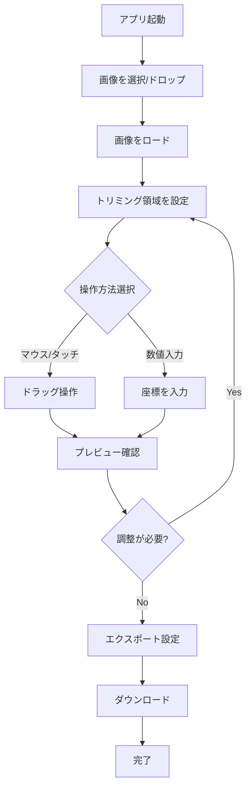

# 画像トリミングアプリ 技術仕様書

## 1. プロジェクト概要

### 1.1 目的
クライアントサイドで完結する画像トリミングアプリケーションを開発する。ユーザーのプライバシーを保護し、サーバーを必要とせず、高速で軽量な画像処理を実現する。

### 1.2 基本要件
- **クライアント完結**: すべての処理をブラウザ内で実行
- **プライバシー保護**: 画像データを外部サーバーに送信しない
- **直感的な操作**: マウス/タッチ操作と数値入力の両方に対応
- **高速動作**: 軽量で低スペック端末でも快適に動作

## 2. 技術スタック

### 2.1 コア技術

| カテゴリ | 技術 |
|---------|------|
| **ランタイム** | **bun** |
| パッケージマネージャー | bun |
| テストランナー | **bun test** |
| トランスパイラー | bun |
| フロントエンドフレームワーク | React |
| ビルドツール | Vite |
| デプロイ先 | **Cloudflare Pages** |

### 2.2 画像処理ライブラリ

**react-image-crop**

### 2.3 画像処理API

**Canvas 2D API**

### 2.4 プロジェクト構成ファイル

#### package.json
```json
{
  "name": "image-crop-app",
  "version": "1.0.0",
  "type": "module",
  "scripts": {
    "dev": "bun --bun vite dev",
    "build": "bun --bun vite build",
    "preview": "bun --bun vite preview",
    "test": "bun test",
    "test:watch": "bun test --watch",
    "test:coverage": "bun test --coverage",
    "deploy": "bunx wrangler deploy"
  },
  "dependencies": {
    "react": "^18.3.1",
    "react-dom": "^18.3.1",
    "react-image-crop": "^11.0.7"
  },
  "devDependencies": {
    "@cloudflare/vite-plugin": "^0.4.0",
    "@types/bun": "^1.2.0",
    "@types/react": "^18.3.3",
    "@types/react-dom": "^18.3.0",
    "@vitejs/plugin-react": "^4.3.1",
    "typescript": "^5.5.3",
    "vite": "^6.0.0",
    "wrangler": "^3.96.0"
  }
}
```

#### tsconfig.json
```json
{
  "compilerOptions": {
    "lib": ["ESNext", "DOM", "DOM.Iterable"],
    "target": "ESNext",
    "module": "ESNext",
    "moduleDetection": "force",
    "jsx": "react-jsx",
    "allowJs": true,

    /* Bundler mode */
    "moduleResolution": "bundler",
    "allowImportingTsExtensions": true,
    "verbatimModuleSyntax": true,
    "noEmit": true,

    /* Linting */
    "skipLibCheck": true,
    "strict": true,
    "noUnusedLocals": true,
    "noUnusedParameters": true,
    "noFallthroughCasesInSwitch": true,
    "noUncheckedSideEffectImports": true
  },
  "include": ["src"]
}
```

## 3. 機能仕様

### 3.1 画像アップロード機能

#### 対応フォーマット
- JPEG (.jpg, .jpeg)
- PNG (.png)
- WebP (.webp)
- GIF (.gif) ※アニメーション非対応

#### アップロード方法
1. ファイル選択ダイアログから選択
2. ドラッグ＆ドロップ
3. クリップボードからの貼り付け（オプション）

#### 制限事項
- 最大ファイルサイズ: 10MB
- 最大解像度: 8000 x 8000 px

### 3.2 トリミング機能

#### マウス/タッチ操作

**基本操作**
| 操作 | 動作 |
|------|------|
| 画像上をドラッグ | 新しいトリミング領域を作成 |
| 領域内をドラッグ | トリミング領域を移動 |
| 領域の端・角をドラッグ | トリミング領域をリサイズ |
| ダブルクリック | トリミング領域をリセット |

**キーボード操作**
| キー | 動作 |
|------|------|
| 矢印キー | トリミング領域を1pxずつ移動 |
| Shift + 矢印キー | トリミング領域を10pxずつ移動 |
| Enter | トリミングを確定 |
| Escape | トリミングをキャンセル |

#### 数値入力による精密制御

**入力フィールド**
```typescript
interface CropInput {
  x: number;      // X座標（px または %）
  y: number;      // Y座標（px または %）
  width: number;  // 幅（px または %）
  height: number; // 高さ（px または %）
  unit: 'px' | '%'; // 単位
}
```

**制御方法**
- 各パラメータを数値入力フィールドで指定
- リアルタイムでプレビューに反映
- 単位（px / %）の切り替えが可能

**実装例:**
```typescript
const [crop, setCrop] = useState<Crop>({
  unit: '%',
  x: 25,
  y: 25,
  width: 50,
  height: 50
});

// 数値入力からの更新
const handleXChange = (e: React.ChangeEvent<HTMLInputElement>) => {
  setCrop(prev => ({ ...prev, x: Number(e.target.value) }));
};
```

#### アスペクト比設定

**プリセット**
- 自由（制限なし）
- 1:1（正方形）
- 4:3
- 16:9
- 3:2
- カスタム（任意の比率を入力）

**動作**
- アスペクト比固定時は、width または height の変更に応じて自動調整
- アスペクト比の変更時、現在の領域を基準に再計算

### 3.3 プレビュー機能

#### リアルタイムプレビュー
- トリミング領域外を暗く表示（オーバーレイ）
- トリミング後の画像を別エリアでプレビュー
- プレビューサイズの調整（拡大/縮小）

#### プレビュー情報の表示
```typescript
interface PreviewInfo {
  originalSize: { width: number; height: number };
  croppedSize: { width: number; height: number };
  fileSize: string; // 推定ファイルサイズ
  aspectRatio: string; // 現在のアスペクト比
}
```

### 3.4 エクスポート機能

#### 出力フォーマット
| フォーマット | 品質設定 | 用途 |
|-------------|---------|------|
| JPEG | 0.1 ~ 1.0 | 写真・一般用途 |
| PNG | - | 透過が必要な場合 |
| WebP | 0.1 ~ 1.0 | 高圧縮率が必要な場合 |

#### ダウンロード機能
- ファイル名の指定（デフォルト: `cropped-{timestamp}.{ext}`）
- 品質の調整（JPEG/WebP）
- ダウンロードボタンクリックで即座にダウンロード

#### クリップボードへのコピー（オプション）
- トリミング後の画像をクリップボードにコピー
- 他のアプリケーションへの貼り付けが可能

## 4. UI/UX設計

### 4.1 レイアウト構成

```
┌─────────────────────────────────────────┐
│  ヘッダー（タイトル・設定）              │
├─────────────────────────────────────────┤
│                                          │
│  ┌──────────────┐  ┌─────────────────┐ │
│  │              │  │ 操作パネル       │ │
│  │  画像表示    │  │                  │ │
│  │  エリア      │  │ - アスペクト比   │ │
│  │              │  │ - 座標入力       │ │
│  │              │  │ - プレビュー     │ │
│  └──────────────┘  │ - エクスポート   │ │
│                     └─────────────────┘ │
│                                          │
└─────────────────────────────────────────┘
```

### 4.2 操作フロー



### 4.3 レスポンシブデザイン

#### ブレークポイント
| デバイス | 幅 | レイアウト |
|---------|-----|----------|
| モバイル | < 640px | 縦スタック |
| タブレット | 640px ~ 1024px | 縦スタック |
| デスクトップ | > 1024px | 横並び |

## 5. データフロー

### 5.1 状態管理

```typescript
interface AppState {
  // 画像関連
  image: {
    file: File | null;
    src: string | null;
    naturalWidth: number;
    naturalHeight: number;
  };

  // トリミング関連
  crop: {
    unit: 'px' | '%';
    x: number;
    y: number;
    width: number;
    height: number;
  };

  // アスペクト比
  aspect: {
    enabled: boolean;
    ratio: number | null;
  };

  // エクスポート設定
  export: {
    format: 'jpeg' | 'png' | 'webp';
    quality: number; // 0.1 ~ 1.0
    filename: string;
  };

  // UI状態
  ui: {
    isProcessing: boolean;
    error: string | null;
  };
}
```

### 5.2 処理フロー

#### 画像読み込み
```typescript
// 1. ファイル選択
const handleFileSelect = (file: File) => {
  // 2. FileReaderで読み込み
  const reader = new FileReader();
  reader.onload = (e) => {
    // 3. 画像オブジェクト作成
    const img = new Image();
    img.onload = () => {
      // 4. 状態を更新
      setImage({
        file,
        src: e.target.result as string,
        naturalWidth: img.naturalWidth,
        naturalHeight: img.naturalHeight
      });
    };
    img.src = e.target.result as string;
  };
  reader.readAsDataURL(file);
};
```

#### トリミング処理
```typescript
// 1. Canvasを作成
const canvas = document.createElement('canvas');
const ctx = canvas.getContext('2d');

// 2. トリミング領域のサイズを設定
canvas.width = crop.width;
canvas.height = crop.height;

// 3. 画像を描画
ctx.drawImage(
  image,
  crop.x, crop.y,        // ソース座標
  crop.width, crop.height, // ソースサイズ
  0, 0,                   // デスティネーション座標
  crop.width, crop.height  // デスティネーションサイズ
);

// 4. Blobに変換
canvas.toBlob((blob) => {
  // 5. ダウンロード処理
  const url = URL.createObjectURL(blob);
  const a = document.createElement('a');
  a.href = url;
  a.download = filename;
  a.click();
  URL.revokeObjectURL(url);
}, `image/${format}`, quality);
```

## 6. パフォーマンス最適化

### 6.1 画像処理の最適化

- **遅延読み込み**: 大きな画像は段階的に読み込み
- **デバウンス**: リアルタイムプレビューの更新頻度を制限（100ms）
- **Web Workers**: 重い処理をバックグラウンドで実行（オプション）

### 6.2 メモリ管理

- **URL.revokeObjectURL**: 使用後のObject URLを即座に解放
- **Canvas解放**: 処理完了後にCanvasを破棄
- **画像のリサイズ**: 表示サイズに合わせた画像を使用

### 6.3 bun による高速化

**開発時:**
```bash
# 依存関係のインストール
bun install

# 開発サーバー起動
bun --bun vite dev
```

**ビルド時:**
```bash
# プロダクションビルド
bun --bun vite build
```

## 7. セキュリティとプライバシー

### 7.1 データ保護

- すべての処理はクライアントサイドで完結
- 画像データをサーバーに送信しない
- ローカルストレージへの保存は行わない（オプション機能として提供可能）

### 7.2 入力検証

```typescript
// ファイルタイプの検証
const ALLOWED_TYPES = ['image/jpeg', 'image/png', 'image/webp', 'image/gif'];
const validateFile = (file: File): boolean => {
  if (!ALLOWED_TYPES.includes(file.type)) {
    throw new Error('サポートされていないファイル形式です');
  }
  if (file.size > 10 * 1024 * 1024) {
    throw new Error('ファイルサイズは10MB以下にしてください');
  }
  return true;
};
```

## 8. アクセシビリティ

### 8.1 キーボード操作

- すべての機能がキーボードで操作可能
- フォーカス状態の明確な表示
- タブ順序の最適化

### 8.2 スクリーンリーダー対応

```tsx
// ARIA属性の付与
<div
  role="application"
  aria-label="画像トリミングエディタ"
  aria-describedby="crop-instructions"
>
  <p id="crop-instructions" className="sr-only">
    矢印キーでトリミング領域を移動、Enterで確定、Escapeでキャンセルします
  </p>
  {/* ... */}
</div>
```

## 9. テスト戦略（bun test）

### 9.1 テスト実装

#### ユニットテスト

**ヘルパー関数のテスト:**
```typescript
// src/utils/cropCalculator.test.ts
import { describe, test, expect } from "bun:test";
import { calculateCropPixels, percentToPixels } from "./cropCalculator";

describe("cropCalculator", () => {
  test("percentToPixels converts percentage to pixels", () => {
    const result = percentToPixels(50, 1000);
    expect(result).toBe(500);
  });

  test("calculateCropPixels calculates correct dimensions", () => {
    const crop = { unit: '%', x: 25, y: 25, width: 50, height: 50 };
    const imageSize = { width: 1000, height: 800 };

    const result = calculateCropPixels(crop, imageSize);

    expect(result).toEqual({
      x: 250,
      y: 200,
      width: 500,
      height: 400
    });
  });
});
```

**React コンポーネントのテスト:**
```typescript
// src/components/CropInput.test.tsx
import { describe, test, expect } from "bun:test";
import { render, screen } from "@testing-library/react";
import { CropInput } from "./CropInput";

describe("CropInput", () => {
  test("renders all input fields", () => {
    render(<CropInput crop={{ x: 0, y: 0, width: 100, height: 100, unit: 'px' }} onChange={() => {}} />);

    expect(screen.getByLabelText(/x座標/i)).toBeDefined();
    expect(screen.getByLabelText(/y座標/i)).toBeDefined();
    expect(screen.getByLabelText(/幅/i)).toBeDefined();
    expect(screen.getByLabelText(/高さ/i)).toBeDefined();
  });
});
```

### 9.2 テストコマンド

```bash
# テスト実行
bun test

# ウォッチモード（ファイル変更時に自動再実行）
bun test --watch

# カバレッジ測定
bun test --coverage

# 特定のファイルのみテスト
bun test src/utils/cropCalculator.test.ts
```

### 9.3 統合テスト

```typescript
// src/__tests__/integration/cropFlow.test.tsx
import { describe, test, expect } from "bun:test";
import { render, screen, fireEvent } from "@testing-library/react";
import { App } from "../../App";

describe("Crop Flow Integration", () => {
  test("complete crop flow from upload to download", async () => {
    render(<App />);

    // 1. ファイル選択
    const fileInput = screen.getByLabelText(/画像を選択/i);
    const file = new File(['dummy'], 'test.jpg', { type: 'image/jpeg' });
    fireEvent.change(fileInput, { target: { files: [file] } });

    // 2. トリミング領域の調整
    const xInput = screen.getByLabelText(/x座標/i);
    fireEvent.change(xInput, { target: { value: '100' } });

    // 3. エクスポート
    const downloadButton = screen.getByText(/ダウンロード/i);
    expect(downloadButton).toBeDefined();
  });
});
```

### 9.4 E2Eテスト（オプション）

Playwright等を使用した実際のブラウザでのテスト:
```bash
# Playwright with bun
bunx playwright test
```

## 10. デプロイメント

### 10.1 Cloudflare Pages へのデプロイ

#### プロジェクト初期化

```bash
# bunでプロジェクト作成
bun create vite image-crop-app -- --template react-ts

# 依存関係のインストール
cd image-crop-app
bun install

# Cloudflare依存関係の追加
bun add -d @cloudflare/vite-plugin wrangler
bun add react-image-crop
```

#### 設定ファイル

**vite.config.ts:**
```typescript
import { defineConfig } from "vite";
import react from "@vitejs/plugin-react";
import { cloudflare } from "@cloudflare/vite-plugin";

export default defineConfig({
  plugins: [react(), cloudflare()],
});
```

**wrangler.jsonc:**
```jsonc
{
  "name": "image-crop-app",
  "compatibility_date": "2025-10-16",
  "assets": {
    "not_found_handling": "single-page-application"
  }
}
```

#### デプロイコマンド

```bash
# ローカル開発
bun run dev

# ビルド
bun run build

# プレビュー
bun run preview

# Cloudflare Pagesへデプロイ
bunx wrangler deploy
```

#### Cloudflare Pages での bun 設定

**環境変数（Cloudflareダッシュボードで設定）:**
```
BUN_VERSION=1.2.0
```

**注意事項:**
- bun v1.2以降は`bun.lock`（テキスト形式）を使用
- Cloudflareが`bun.lock`を認識しない場合、空の`bun.lockb`を追加

**回避策:**
```bash
# プロジェクトルートに空のbun.lockbを作成
touch bun.lockb
```

### 10.2 代替デプロイ先

- Vercel
- Netlify
- GitHub Pages

### 10.3 PWA対応（オプション）

**manifest.json:**
```json
{
  "name": "画像トリミングアプリ",
  "short_name": "Crop App",
  "description": "クライアントサイドで動作する画像トリミングアプリ",
  "start_url": "/",
  "display": "standalone",
  "background_color": "#ffffff",
  "theme_color": "#000000",
  "icons": [
    {
      "src": "/icon-192.png",
      "sizes": "192x192",
      "type": "image/png"
    },
    {
      "src": "/icon-512.png",
      "sizes": "512x512",
      "type": "image/png"
    }
  ]
}
```

**Service Worker:**
- オフライン対応
- アプリシェルのキャッシュ
- ホーム画面への追加

## 11. 今後の拡張機能

### 11.1 高優先度

- [ ] 回転機能
- [ ] 反転機能（水平/垂直）
- [ ] 複数画像の一括処理
- [ ] トリミング履歴の管理（Undo/Redo）

### 11.2 中優先度

- [ ] フィルター機能（明るさ、コントラスト、彩度など）
- [ ] テキスト・図形の追加
- [ ] テンプレート機能（SNS用サイズなど）
- [ ] ドラッグ順序の変更（複数画像処理時）

### 11.3 低優先度

- [ ] Cloudflare R2との連携（画像保存）
- [ ] 高度な編集機能（レイヤー、マスクなど）
- [ ] Workers AIによる自動トリミング提案

## 12. 開発スケジュール（目安）

| フェーズ | 期間 | 内容 |
|---------|------|------|
| セットアップ | 0.25日 | bun環境構築、依存関係のインストール |
| 基本UI実装 | 2-3日 | レイアウト、コンポーネント作成 |
| トリミング機能 | 3-4日 | react-image-cropの統合、操作実装 |
| 数値入力機能 | 1-2日 | 座標入力フィールドの実装 |
| エクスポート機能 | 1-2日 | Canvas処理、ダウンロード機能 |
| UI/UX改善 | 2-3日 | レスポンシブ対応、アクセシビリティ |
| テスト | 0.5-1日 | bun testでの高速テスト実装 |
| デプロイ | 0.25日 | Cloudflare Pagesへのデプロイ |

**合計**: 約10-15日

## 13. リファレンス

### 13.1 公式ドキュメント

**bun 関連:**
- [bun 公式サイト](https://bun.sh/)
- [bun ドキュメント](https://bun.sh/docs)
- [bun test](https://bun.sh/docs/cli/test)
- [bun TypeScript](https://bun.sh/docs/typescript)

**React & フレームワーク:**
- [React](https://react.dev/)
- [react-image-crop](https://github.com/DominicTobias/react-image-crop)
- [Vite](https://vitejs.dev/)

**Cloudflare:**
- [Cloudflare Vite Plugin](https://developers.cloudflare.com/workers/vite-plugin/)
- [Cloudflare Pages](https://developers.cloudflare.com/pages/)

**Web API:**
- [Canvas API](https://developer.mozilla.org/en-US/docs/Web/API/Canvas_API)

### 13.2 参考実装

- [Bun + React Examples](https://bun.sh/guides/ecosystem/react)
- [Bun + Vite Guide](https://bun.sh/guides/ecosystem/vite)
- [react-image-crop Demo](https://github.com/DominicTobias/react-image-crop#demo)
- [Cloudflare Vite Tutorial](https://developers.cloudflare.com/workers/vite-plugin/tutorial/)

---

**作成日**: 2025-10-16
**最終更新**: 2025-10-16
**バージョン**: 3.0.0
